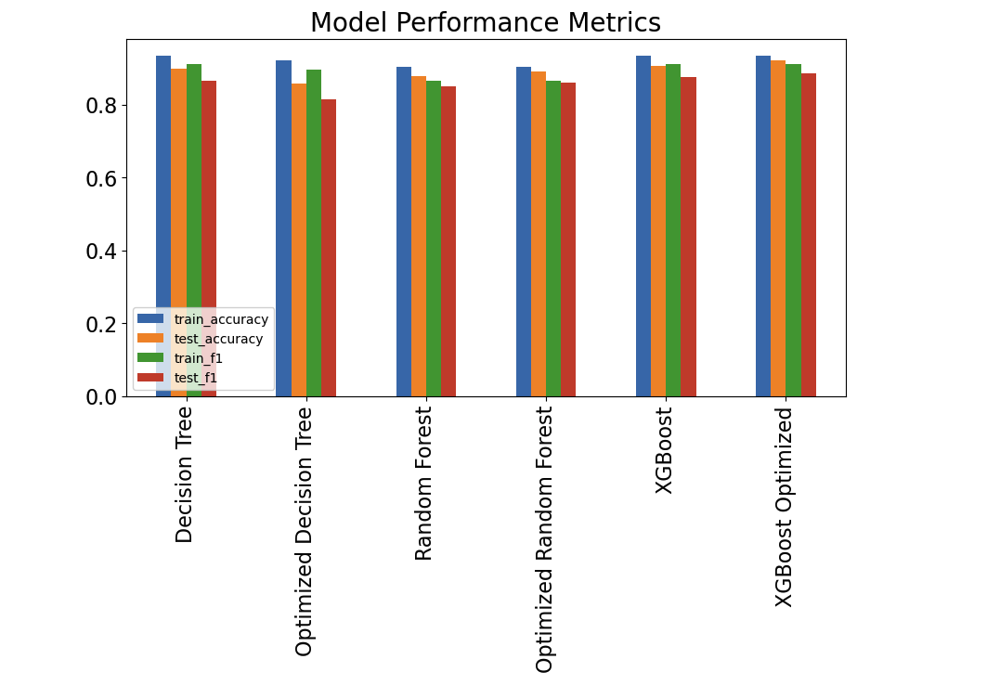

# Students Adaptivity Level In Online Education

Author Emily Marsh

## Introduction

During the COVID pandemic many students were suddenly thrust into a digital only learning enviorment. Some student adapted to this new learning enviorment better then others and those who did not suffered a huge set back in terms of their education. However, online learning is here to stay. The Department of Education has commissioned this project to create a model to predict a students adaptivity level in order to identify students who need more assistance adapting to online learning and how best to help them.

## Business Objective

This project will assist the Federal Department of Education by creating a model that will predict a students level of adaptivity based on **twelve independent factors**. The Department will use this model to identify students who are at risk of being **low or moderate level of adaptivity to online learning**. The model will also be used to identify which features are the most important for acheiving a high level of adaptivity. These features, once discovered, can be used to recommend modifications for online curriculum, support for students and recommendations that the Department of Education can share with educators, parents and students. Students can have three different levels of adaptivity to online education:

 - **Low**
 - **Moderate**
 - **High**

Since the model will be used for identifying feature importance as well as predicting the level of adaptivity of the student, **F1 Score** will be used to assess the accuracy of the models developed using the dataset. The reason for using an F1 score versus any other metrics of accuracy is that eliminating false negatives and false positives will ensure the accuracy of the feature recommendations. This model will be designed to be proactive as well as reactive, therefore eliminating false positives and negatives will be the goal.

## Dataset
The dataset used for this project is from Kaggle. The information in the dataset was collected using an online and offline survey and was sent to students at varying education levels in Bangledesh. Overall, the dataset contains **1205 survey responses** collected between **Dec 10th 2020 and Feb 5th 2021**. The **14 attributes** for each entry are are **age, gender, level, govt./non-govt. institution, location, IT student or not, educational background, load shedding level, internet quality, class-time, the economic condition of the family, device type used while attending classes, and institution’s own LMS availability**. A table from the paper published about the methodology of this dataset is included below with a detailed description of each feature.

## Methods

In order to determine which baseline model is appropriate for the dataset, baseline models will be built, then optimized using parameter tuning. Additional ensemble models will also be built and optimized. Once built, the most accurate baseline model will be selected to fine tune and determine feature importance. The F1 score will be used as a determinate of which model is the most accurate. The reason the F1 score will be used is that, as an expression of the precision and recall of the model, the higest F1 score limits the amount of false positives and false negatives. This is important since the project wants a model to correctly assess the adaptivity level of students at all three values (low, moderate & high). 

## Visualizing Model Performance

Using the visualization, the **XGBoost Optimized Model** has one of the highest AUC values and F1 scores. Most importantly though, the AUC values and F1 scores are the closest between the test and train data. This shows that the optimized XGBoost is the best model to use for accuracy because it avoided overfitting to the train dataset. This will be the model that will be utilized for prediction and determing feature importance.

## Feature Importance As Determined by SHAP Values

Feature importance was determined using **SHAP values**. It is model-agnostic and uses the Shapley values from game theory to estimate how each feature contributes to the prediction. According to the SHAP values the top three most important features were **4G network, being the financial condition of Rich, and zero hours of daily instruction time along with the online education**. However, by using SHAP values more information is given about how these features are important. Unlike the previous two feature importance calculations, the SHAP values provide the average impact on each class level of the dependent variable, Adaptivity Level. This is much more useful for determining feature recommendations that can improve the chances a student will be high adaptivity level versus low or moderate.

# Conclusion

The Federal Department of Education has a model that will have a **93% probability of accurately predicting a student with low adaptivity to online learning**, a **92% probability of accurately predicting a student with moderate adaptivity**, and a **79% probability of accurately predicting a student with high adaptivity**. The **average F1 score of the model for the test dataset was .91**.

Using SHAP values from the final model, the following three features were determined to have the higest average impact on model output magnitude.

 1. **4G Network for Online Education**
 2. **Rich Financial Condition**
 3. **Zero Hours of Daily Instruction**

All three of these features are recommended to the Department of Education for additional research in order to determine proactive actions that can be taken to increase the probability that students will be at a high adaptivity level with their online education. Of these three features, **Zero Hours of Daily Instruction** is the only feature that has a high impact on low and moderate adaptivity levels and has no affect on high adaptivity levels. Therefore it maybe be the most efficent way to decrease the amount of low and moderate adaptivity students.

## Next Steps

To continue working towards the goal of a highly predictive model and proactive recommendations based on feature findings, the Federal Department of Education could follow these additional suggestions:

 - **Conduct additional surveys with students within the United States Educational System**
 - **Conduct additional research into the impact of top features on low, moderate, and high adaptivity levels**
 - **Additional exploration into optimized parameters for the XGBoost Model to increase AUC and F1 scores**

## References

 - https://www.kaggle.com/datasets/mdmahmudulhasansuzan/students-adaptability-level-in-online-education
 - https://www.kaggle.com/code/tilii7/hyperparameter-grid-search-with-xgboost
 - https://mljar.com/blog/feature-importance-xgboost/

## For More Information

The full analysis and process by which these conclusions were reached can be found in the Jupyter notebook or by reviewing the summary presentation.

For additional questions, contact Emily Marsh: marshemily2@gmail.com

## Repository Structure

 |── Data
 
 ├── Images
 
 ├── README.md
 
 ├── PhaseThreeFinalProjectPresentation.pdf
 
 └── PhaseThreeProject.ipynb
